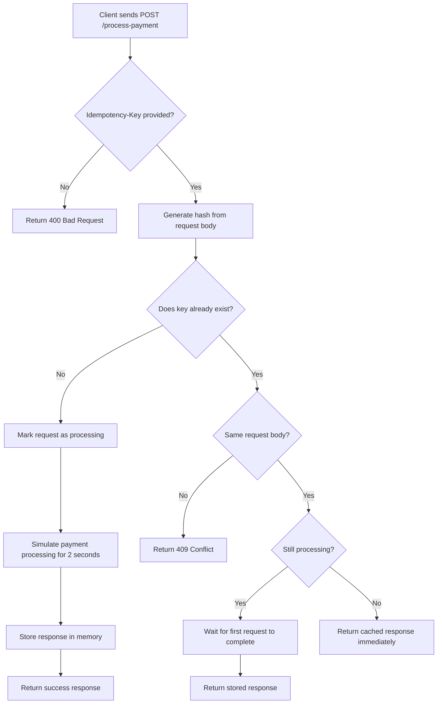

# Idempotency Gateway – Pay Once Protocol

## Project Overview

This project is a simple REST API built to solve a common payment processing issue called **double charging**.

In real payment systems, a client application may retry a payment request if the network is slow or times out. Without protection, the same payment could be processed multiple times, causing customers to be charged more than once.

This solution introduces an **idempotency layer** that ensures the same payment request is processed only once, even if the client retries multiple times using the same idempotency key.

---

## Architecture Diagram



---

## Tech Stack

This project was built using:

- **Node.js**
- **Express.js**
- **JavaScript**
- **In-memory Map storage**
- **SHA-256 hashing (crypto module)**

---

## Setup Instructions

### 1. Clone the repository

```bash
git clone https://github.com/YOUR-USERNAME/SheCanCode-associate-Assessment-.git
```

### 2. Move into the project directory

```bash
cd SheCanCode-associate-Assessment-
```

### 3. Install dependencies

```bash
npm install
```

### 4. Start the server

```bash
npm start
```

If successful, you should see:

```bash
Server running on http://localhost:3000
```

---

## API Documentation

### Endpoint

```http
POST /process-payment
```

Full URL when running locally:

```http
http://localhost:3000/process-payment
```

---

## Request Headers

| Header | Value |
|--------|-------|
| Idempotency-Key | any unique string |

Example:

```http
Idempotency-Key: payment-12345
```

---

## Request Body

Example JSON request:

```json
{
  "amount": 100,
  "currency": "GHS"
}
```

---

## Example Responses

### 1. First Successful Request

When a payment request is sent for the first time:

**Response:**

```json
{
  "message": "Charged 100 GHS",
  "status": "success"
}
```

**Status Code:**

```http
201 Created
```

---

### 2. Duplicate Request with Same Key and Same Payload

If the same request is sent again:

**Response:**

```json
{
  "message": "Charged 100 GHS",
  "status": "success"
}
```

**Response Header:**

```http
X-Cache-Hit: true
```

**Behavior:**
- No new payment processing happens
- Response is returned immediately

---

### 3. Same Key with Different Request Body

If the same idempotency key is reused for a different payment:

Example:

```json
{
  "amount": 500,
  "currency": "GHS"
}
```

**Response:**

```json
{
  "error": "Idempotency key already used for a different request body."
}
```

**Status Code:**

```http
409 Conflict
```

---

### 4. Missing Idempotency Header

If the request does not include the required header:

**Response:**

```json
{
  "error": "Idempotency-Key header is required."
}
```

**Status Code:**

```http
400 Bad Request
```

---

### 5. Invalid Payment Data

If invalid payment details are sent:

Example:

```json
{
  "amount": -50,
  "currency": ""
}
```

**Response:**

```json
{
  "error": "Amount must be greater than 0 and currency is required."
}
```

**Status Code:**

```http
400 Bad Request
```

---

## Design Decisions

### In-Memory Storage (Map)

I used JavaScript’s built-in `Map` object to store idempotency records.

This makes lookup fast and keeps implementation simple for the assessment.

Stored data includes:
- Idempotency key
- Request body hash
- Processing status
- Saved response

---

### Request Body Hashing

To ensure the same idempotency key is not reused with different payment data, the request body is hashed using SHA-256.

This allows accurate comparison without relying on raw object matching.

---

### Cached Response Replay

When the same valid request is received again, the API returns the previously stored response instead of processing the payment again.

This prevents duplicate charges.

---

### In-Flight Request Protection

If two identical requests arrive at almost the same time:
- the first request begins processing
- the second request waits
- once processing completes, both receive the same response

This prevents race conditions.

---

## Developer’s Choice Feature

### Request Validation

I added payment request validation as an extra safety feature.

Checks include:
- amount must be greater than zero
- currency must not be empty
- idempotency key must be provided

This improves reliability because invalid payment requests should never be processed in a real fintech environment.

---

## Testing

The API was tested using **Postman**.

Test scenarios covered:
- successful payment processing
- duplicate request replay
- same key with different payload
- missing header validation
- invalid payment request validation

---

## Project Structure

```text
SheCanCode-associate-Assessment-
│
├── src
│   ├── server.js
│   ├── routes
│   │   └── paymentRoutes.js
│   ├── services
│   │   └── idempotencyService.js
│   └── utils
│       └── hash.js
│
├── package.json
├── package-lock.json
├── .gitignore
└── README.md
```

